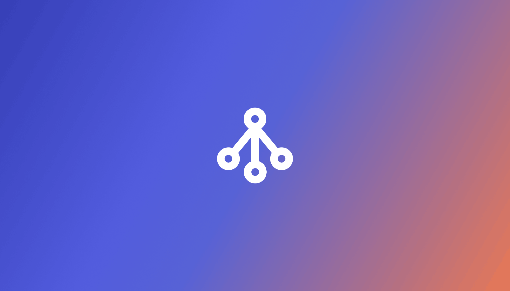
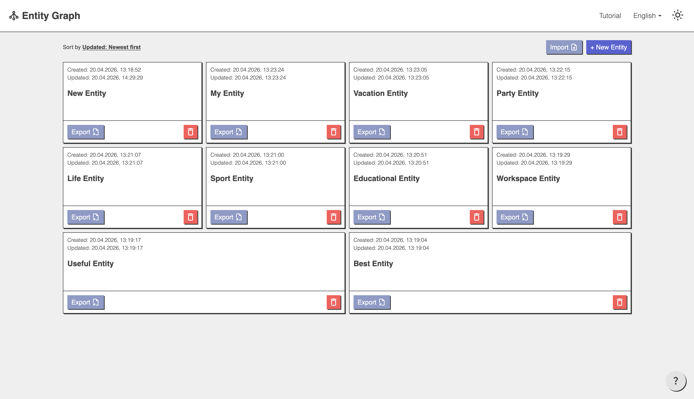
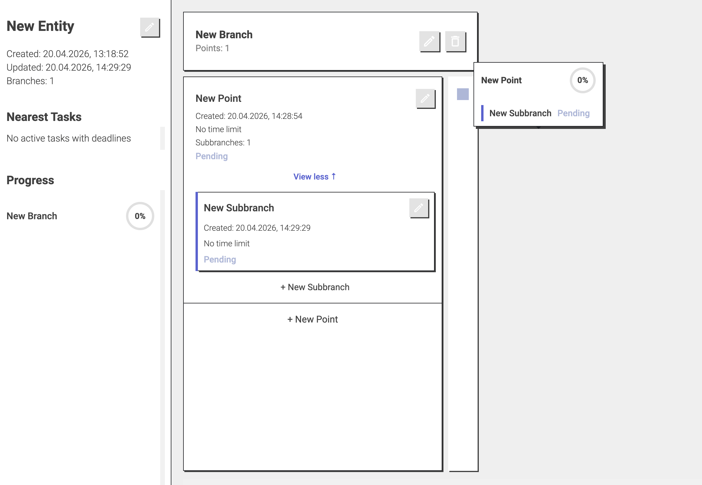

# Entity Graph

_This application was created for the convenient graphical display of a learning stage plan. I wanted to implement the ability to build several major learning branches within a single topic, each of which can contain different stages and substages. Also, the ability to view your plan as a dependency tree — for a visual understanding of the direction of movement in learning._

_I wanted to create an application without reliance on network file storage. Therefore, data is stored locally, and using the application on different devices requires export/import. This decision was made for personal reasons. However, anyone can always add their own implementation of a network database._

_Use it, experiment, improve._


## Features

- Create and manage entities
- Build hierarchical trees and branches with your tasks
- Track progress and statuses
- Export / Import data (JSON format)
- Dark / Light theme support
- Multi-language support (English, Russian)
- Real-time graph visualization
- Responsive design



## Installation

To install, you need to:

### Download and install Node.js

Official *Node.js* website:

[Download](https://nodejs.org/en/download/package-manager)

### Open a terminal

Then verify that everything is installed correctly. To do this, **open a terminal** and **enter the command**:

```bash
# check the Node.js version
node -v

# the terminal will output your current version
v20.17.0 (example)
```

Since Node.js is installed, NPM should also be in place. You can verify this by running:

```bash
# Enter the command
npm -v

# You will see the same or later version
10.8.3
```

## Running the application

Download the project to your device, navigate to the project root folder via the terminal, and then enter the commands:

```bash
# To install all project dependencies
npm install
```

After a successful installation, enter:

```bash
# To run the project
npm run dev
```

If the project starts without errors, a browser page will open automatically. (Alternatively, type **localhost:3002** in your browser's address bar)

## Build

To build the final project package, while in the project root folder, run the command:

```bash
npm run build
```

After running the build command, the actual files will appear in the dist folder of the project and must be uploaded to hosting.


## Technologies Used
 - React 18 — UI framework
 - TypeScript — Type safety
 - Vite — Build tool and development server
 - i18next — Internationalization
 - React Router — Navigation
 - CSS Modules — Component styling


## Usage

### Creating an Entity
1. On the home page, click the "New Entity" button
2. Enter a name for your entity
3. Start adding branches and items

### Managing Branches
1. Click "New Branch" to create a hierarchical structure
2. Add points and subbranches to organize your tasks
3. Hover over items to view their subbranches and status

### Tracking Progress
 - View your progress in the left sidebar
 - Check task statuses in the graphical view
 - Update statuses as you complete tasks

### Export/Import
 - Export your entities as JSON files for backup
 - Import previously exported data to restore your work


## License
This project is licensed under the MIT License - see the LICENSE file for details.


## Author

 - GitHub: https://github.com/ArtPsycho
 - Telegram: @ArtPsychoCreator